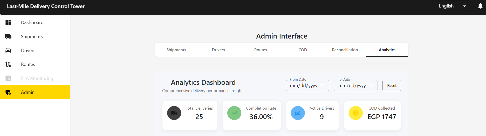
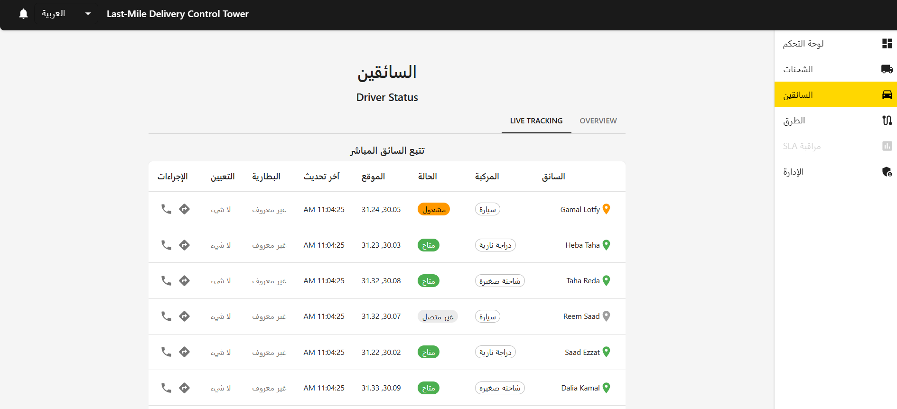
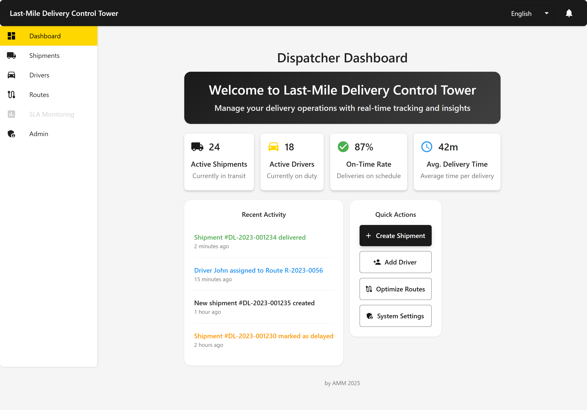
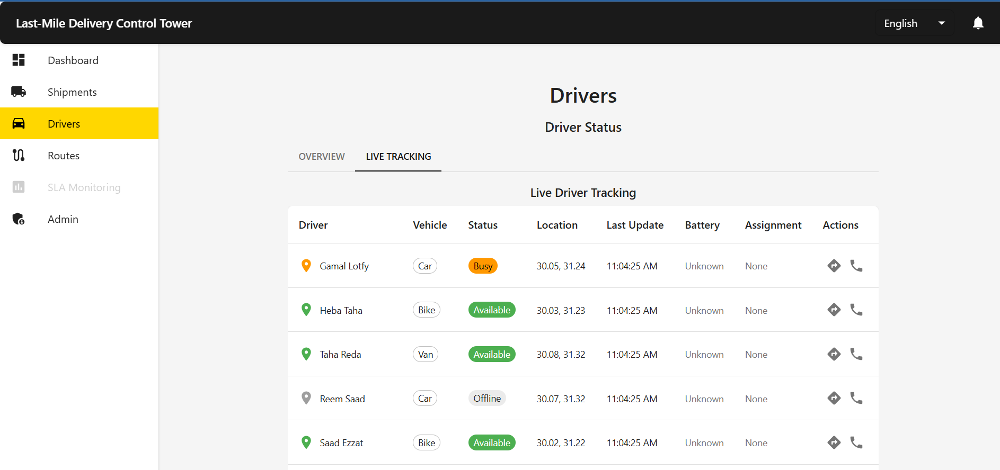
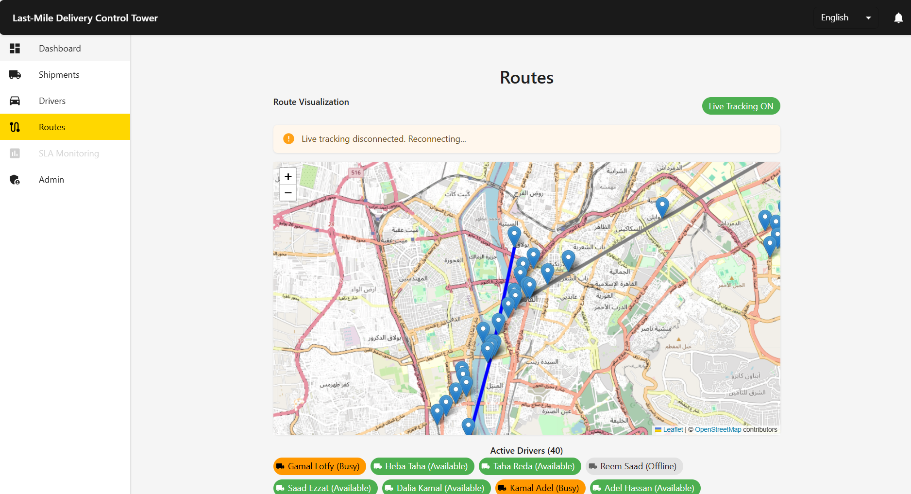
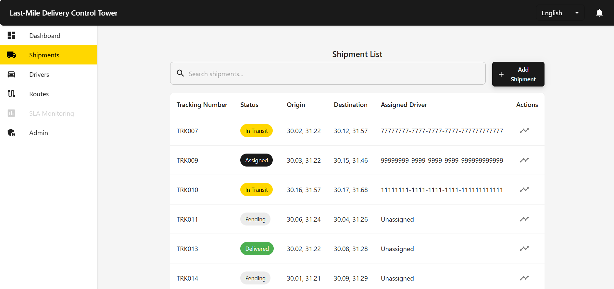
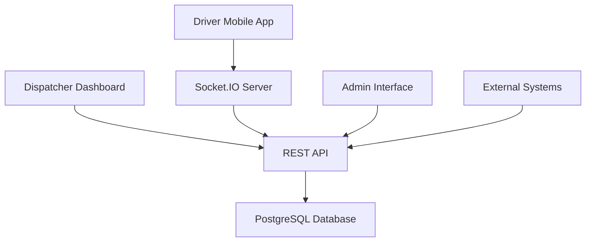

# Last-Mile Delivery Control Tower

[](LICENSE)
[](https://nodejs.org/)
[](https://last-mile-control-tower.vercel.app)
[](https://reactjs.org/)
[](https://nodejs.org/)
[](https://expressjs.com/)
[](https://www.postgresql.org/)

A comprehensive last-mile delivery management system that provides real-time tracking, route optimization, and operational control for delivery operations.

## Table of Contents

- [Live Demo](#live-demo)
- [Features](#features)
- [Screenshots](#screenshots)
- [Architecture](#architecture)
- [Tech Stack](#tech-stack)
- [Project Structure](#project-structure)
- [Getting Started](#getting-started)
  - [Prerequisites](#prerequisites)
  - [Installation](#installation)
  - [Environment Variables](#environment-variables)
  - [Database Setup](#database-setup)
  - [Running the Application](#running-the-application)
- [Scripts](#scripts)
- [API Endpoints](#api-endpoints)
- [API Documentation](#api-documentation)
- [Testing](#testing)
- [Deployment](#deployment)
- [CI/CD](#cicd)
- [Troubleshooting](#troubleshooting)
- [About the Author](#about-the-author)
- [License](#license)

## Live Demo

Check out the live demo of the Last-Mile Delivery Control Tower:

Live Demo (Web): <https://last-mile-control-tower.vercel.app>

## Features

### Core Features
- **Dispatcher Dashboard** - Visualize active routes and driver status
- **Route Assignment** - Assign shipments to drivers with basic optimization
- **Driver Mobile App** - Driver interface as Progressive Web App (PWA)
- **Live Tracking** - Real-time location updates on the dashboard
- **Proof of Delivery** - OTP-based delivery confirmation
- **Basic Analytics** - Dashboard with delivery metrics

### Advanced Features
- **Cash on Delivery (COD)** - Complete COD tracking and reconciliation functionality
- **SLA Monitoring** - Real-time SLA monitoring dashboard with KPIs
- **Advanced Analytics** - Comprehensive analytics and reporting features
- **Production Ready** - Application prepared for production deployment
- **Enhanced UI/UX** - Refined user interface across all components

## Screenshots

### Admin Dashboard


### RTL Support (Arabic)


### Main View


### Drivers Management


### Routes Management


### Shipments Management


## Architecture



The system follows a client-server architecture with:
- **Frontend**: React-based dispatcher dashboard and admin interface
- **Mobile**: React Native/Expo-based driver application
- **Backend**: Node.js/Express REST API with Socket.IO for real-time communication
- **Database**: PostgreSQL for data persistence
- **Real-time**: Socket.IO for live tracking and notifications

## Tech Stack

- **Frontend**: React, Material-UI, Recharts
- **Mobile**: React Native/Expo
- **Backend**: Node.js, Express.js
- **Database**: PostgreSQL
- **Real-time**: Socket.IO
- **Testing**: Jest, Supertest
- **Deployment**: Vercel
- **CI/CD**: GitHub Actions
- **Package Manager**: npm

## Project Structure

```
last-mile-control-tower/
├── src/
│   ├── backend/
│   │   ├── controllers/
│   │   ├── models/
│   │   ├── routes/
│   │   ├── services/
│   │   ├── socketio/
│   │   └── utils/
│   ├── frontend/
│   │   ├── src/
│   │   │   ├── components/
│   │   │   ├── services/
│   │   │   └── App.jsx
│   │   └── package.json
│   ├── mobile/
│   │   ├── src/
│   │   └── app.json
│   ├── database/
│   └── shared/
├── tests/
├── docs/
├── .github/workflows/
└── package.json
```

## Getting Started

### Prerequisites

- Node.js >= 16.x
- npm >= 8.x
- PostgreSQL >= 13.x

### Installation

1. Clone the repository:
   ```bash
   git clone https://github.com/ahmedmmkms/last-mile-control-tower.git
   cd last-mile-control-tower
   ```

2. Install backend dependencies:
   ```bash
   npm install
   ```

3. Install frontend dependencies:
   ```bash
   cd src/frontend
   npm install
   cd ../..
   ```

### Environment Variables

Create a `.env` file based on `.env.example`:

| Variable | Description | Default |
|----------|-------------|---------|
| `DB_HOST` | PostgreSQL database host | `your-supabase-db-host.pooler.supabase.com` |
| `DB_PORT` | PostgreSQL database port | `5432` |
| `DB_NAME` | PostgreSQL database name | `postgres` |
| `DB_USER` | PostgreSQL database user | `your-supabase-db-user` |
| `DB_PASSWORD` | PostgreSQL database password | `your-supabase-db-password` |
| `PORT` | Server port | `3000` |
| `API_BASE_URL` | API base URL | `http://localhost:3000/api` |
| `DEPLOYED_URL` | Vercel deployment URL | `https://your-app-name.vercel.app` |

### Database Setup

1. Set up a PostgreSQL database (see [Database Setup Guide](docs/database-setup-guide.md))
2. Run database migrations:
   ```bash
   npm run migrate
   ```
3. (Optional) Seed the database with sample data:
   ```bash
   npm run seed
   ```

### Running the Application

#### Development Mode

1. Start the backend server:
   ```bash
   npm run dev
   ```

2. In a separate terminal, start the frontend development server:
   ```bash
   cd src/frontend
   npm run dev
   ```

3. Visit `http://localhost:5173` to view the dashboard

#### Production Mode

1. Build the frontend:
   ```bash
   npm run build-frontend
   ```

2. Start the server:
   ```bash
   npm start
   ```

## Scripts

| Script | Description |
|--------|-------------|
| `npm start` | Start the production server |
| `npm run dev` | Start the development server with nodemon |
| `npm run build-frontend` | Build the frontend application |
| `npm run migrate` | Run database migrations |
| `npm run seed` | Seed the database with sample data |
| `npm test` | Run all tests |
| `npm run test:unit` | Run unit tests |
| `npm run test:integration` | Run integration tests |
| `npm run test:api` | Run API tests |

## API Endpoints

### COD Management
| Method | Endpoint | Description |
|--------|----------|-------------|
| `POST` | `/api/cod` | Create a new COD payment |
| `GET` | `/api/cod/:id` | Get COD payment by ID |
| `GET` | `/api/cod/shipment/:shipmentId` | Get COD payment by shipment ID |
| `GET` | `/api/cod` | Get all COD payments with optional filters |
| `PUT` | `/api/cod/:id/status` | Update COD payment status |
| `GET` | `/api/cod/summary` | Get COD summary statistics |
| `GET` | `/api/cod/driver/:driverId` | Get COD payments by driver |

### Driver Management
| Method | Endpoint | Description |
|--------|----------|-------------|
| `GET` | `/api/drivers` | Get all drivers |
| `GET` | `/api/drivers/:id` | Get driver by ID |
| `POST` | `/api/drivers` | Create a new driver |
| `PUT` | `/api/drivers/:id` | Update driver |
| `DELETE` | `/api/drivers/:id` | Delete driver |
| `PUT` | `/api/drivers/:id/location` | Update driver location |
| `PUT` | `/api/drivers/:id/status` | Update driver status |
| `GET` | `/api/drivers/:id/assignments` | Get driver assignments |

### Shipment Management
| Method | Endpoint | Description |
|--------|----------|-------------|
| `GET` | `/api/shipments` | Get all shipments |
| `GET` | `/api/shipments/:id` | Get shipment by ID |
| `POST` | `/api/shipments` | Create a new shipment |
| `PUT` | `/api/shipments/:id` | Update shipment |
| `DELETE` | `/api/shipments/:id` | Delete shipment |
| `PUT` | `/api/shipments/:id/status` | Update shipment status |
| `POST` | `/api/shipments/:id/pod` | Submit proof of delivery |

## Testing

Run all tests:
```bash
npm test
```

Run specific test suites:
```bash
npm run test:unit      # Unit tests
npm run test:integration # Integration tests
npm run test:api       # API tests
```

## Deployment

### Vercel Deployment

1. Set up a Vercel account
2. Connect your GitHub repository
3. Configure environment variables in Vercel dashboard
4. Deploy the application

## CI/CD

The project uses GitHub Actions for continuous integration and deployment:

- **CI**: Runs tests on every push and pull request
- **CD**: Deploys to Vercel on pushes to the main branch

Workflows are defined in `.github/workflows/`:
- `ci.yml`: Continuous integration
- `cd.yml`: Continuous deployment
- `ci-cd.yml`: Combined CI/CD pipeline

## Troubleshooting

### Common Issues

1. **Database Connection Failed**
   - Check your database credentials in `.env`
   - Ensure PostgreSQL is running
   - Verify network connectivity to the database

2. **Port Already in Use**
   - Change the `PORT` environment variable
   - Kill the process using the port:
     ```bash
     lsof -i :3000
     kill -9 <PID>
     ```

3. **Frontend Not Loading**
   - Ensure the backend server is running
   - Check the console for network errors
   - Verify `API_BASE_URL` in environment variables

4. **Tests Failing**
   - Ensure all dependencies are installed
   - Check that the database is accessible
   - Run database migrations before testing

5. **Node Version Issues**
   - Use Node.js >= 16.x
   - Consider using `nvm` to manage Node versions

## About the Author

I deliver production‑grade commerce experiences — fast, bilingual, and reliable.

**Architecture that holds**: modular monorepo, service boundaries, and serverless‑ready APIs.

**Ops you can trust**: CI/CD, migrations, observability, performance/load testing hooks.

**Great DX**: clean code, documentation, scripted acceptance, and smooth handoffs.

**Customer‑centric UX**: accessibility and Arabic‑first details you don't have to ask for.

### Contact:
[](https://www.linkedin.com/in/ahmedmmkms/)

### Services:
- Product engineering
- Architecture
- Cloud/DevOps
- Developer experience
- Performance optimization
- Accessibility compliance
- Internationalization (i18n)

## License

This project is licensed under the Apache License 2.0 - see the [LICENSE](LICENSE) file for details.
